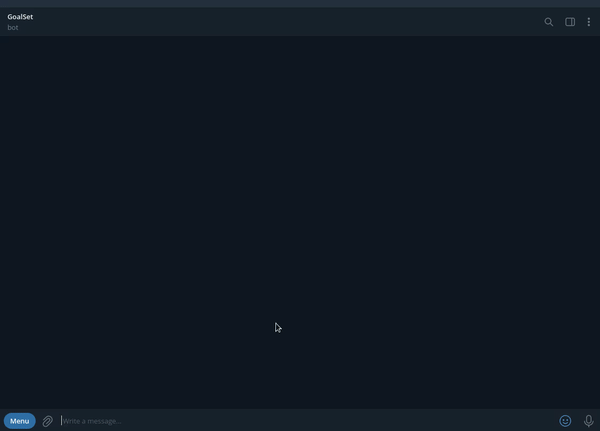

# Goalset bot
The todo telegram bot. Bot translated into two languages. You can mark the goal as finished, canceled or removed. Also exists a statistic button that shows the amount of finished and canceled goals. Finally, the bot changes tomorrow's goals to today's goals when the time arrives at 21:00.

